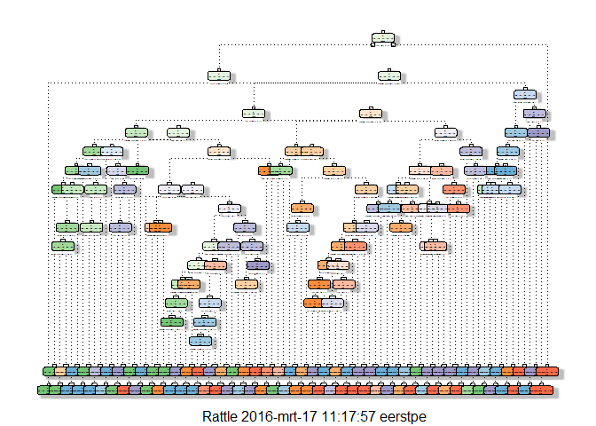

Introduction
============

Using devices such as Jawbone Up, Nike FuelBand, and Fitbit it is now
possible to collect a large amount of data about personal activity
relatively inexpensively. These type of devices are part of the
quantified self movement – a group of enthusiasts who take measurements
about themselves regularly to improve their health, to find patterns in
their behavior, or because they are tech geeks. One thing that people
regularly do is quantify how much of a particular activity they do, but
they rarely quantify how well they do it. In this project we use data
from accelerometers on the belt, forearm, arm, and dumbell of 6
participants. They were asked to perform barbell lifts correctly and
incorrectly in 5 different ways. More information is available from the
website here: <http://groupware.les.inf.puc-rio.br/har> (see the section
on the Weight Lifting Exercise Dataset).

### Goal and approach

We will try to prodict the correct classification. We will first try a
simple model that is very descriptive; a traditional tree. Later on we
will try a randon forest to see whether this is more accurate.

Data
====

We will load the data, transform it and split in training and testset.

### Load data

We will load the prepared data.

    train = read.csv("C:/TFS/Additional/R/Machine Learning/Project/pml-training.csv")
    validate = read.csv("C:/TFS/Additional/R/Machine Learning/Project/pml-testing.csv")

### Data wrangling

Change the datatype.

    train$classe = as.factor(train$classe)

Remove incomplete columns and focus on the columns of interest.

    incompleteColumns <- sapply(train, function (x) any(is.na(x) | x == ""))
    focusAreas = grepl("belt|_arm|dumbbell|forearm", colnames(train))
    finalColumns = !incompleteColumns & focusAreas
    finalColNames = c(colnames(train[,finalColumns]),"classe")

### Cross validation

Split in training and testingset, 75% training, 25% test. This will
allow us to estimate the out of sample error.

    inTrain = createDataPartition(train$classe, p = 3/4)[[1]]
    training = train[ inTrain,finalColNames]
    testing = train[-inTrain,finalColNames]

Model building process
======================

We will try to create a model that is easily interpretatble. For this
reason we fit a regular tree. Later on we will try a more advanced
method (random forest).

### Parameter tuning

Before build a tree we set the parameters. Cross validation (3 folds)
was used for parameter tuning. This performs wel and remains accurate
enough.

    fitControl <- trainControl(
      method = "cv",
      number = 3,
      allowParallel=TRUE  )

Fitting one tree
----------------

We fit a simple model.

    modfit = train(classe ~ ., data=training, method="rpart" , trControl=fitControl, tuneLength=50)
    fancyRpartPlot(modfit$finalModel)

<!-- -->

View the number of predictions, the accuracy on the training- and
testset:

    d = data.frame(predict(modfit, training))
    colnames(d) = "prediction"
    length(d$prediction)

    ## [1] 14718

    confusionMatrix(predict(modfit, training),training$classe)$overall['Accuracy']

    ##  Accuracy 
    ## 0.9056937

    confusionMatrix(predict(modfit, testing),testing$classe)$overall['Accuracy']

    ##  Accuracy 
    ## 0.8902936

We built one tree that is human readible, althoug is it very extensive.
The accuracy is very high, not only on the training set, but also on the
testset, indicating its not overfitting.

Multiple trees
--------------

What would happen when we create multiple tries (a lot) with few
predictors. This could improve accuracy.

We set the tuning parameters to use only a few predictors per tree:

    mtryGrid <- expand.grid(mtry = c(8,10, 11))

### Fitting and results

The random forest treefit:

    TreeFit <- train(classe ~ ., data = training[, finalColNames],
                     method = "rf", ntree=300, trControl=fitControl, tuneGrid =mtryGrid)

The following number of variables have been chosen at each split:

    TreeFit$finalModel$mtry

    ## [1] 11

The accuracy of the model on the trainingset:

    confusionMatrix(predict(TreeFit, training),training$classe)$overall['Accuracy']

    ## Accuracy 
    ##        1

The accuracy of the model on the testset:

    confusionMatrix(predict(TreeFit, testing),testing$classe)$overall['Accuracy']

    ##  Accuracy 
    ## 0.9965334

Error rate:

    1 - confusionMatrix(predict(TreeFit, testing),testing$classe)$overall['Accuracy']

    ##    Accuracy 
    ## 0.003466558

### Conclusion

A single tree yielded good results. The randon forest yielded even
better results. For understanding the single tree is preferrable because
it can be explained more easily.

For prediction we used the randon forest. It turned out all cases were
predicted correctly.
